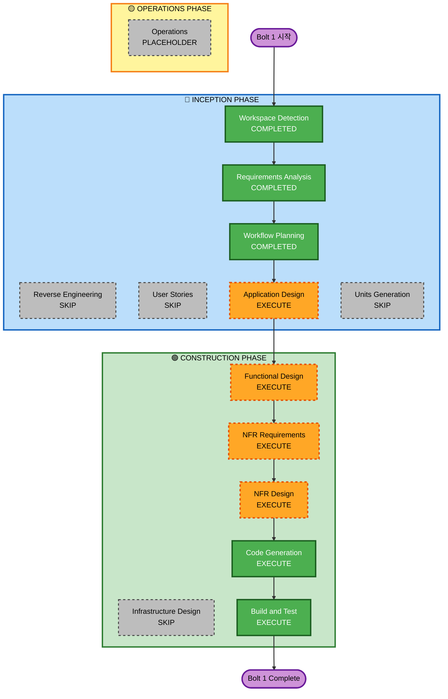

# Execution Plan — Bolt 1

## Analysis Summary

### Change Impact Assessment

| 영역 | 해당 여부 | 설명 |
|------|-----------|------|
| User-facing changes | Yes | Admin 로그인 UI, 대시보드 레이아웃 |
| Structural changes | Yes | 전체 프로젝트 구조 신규 생성 |
| Data model changes | Yes | 전체 DB 스키마 초기 마이그레이션 |
| API changes | Yes | Supabase Auth API 연동 |
| NFR impact | Yes | Security Extension 활성화 (auth 보안 요구사항) |

### Risk Assessment

| 항목 | 평가 |
|------|------|
| **Risk Level** | Low |
| **Rollback Complexity** | Easy (초기 셋업이므로 재시작 가능) |
| **Testing Complexity** | Moderate (auth 플로우 테스트 필요) |

---

## Workflow Visualization



### Text Alternative (Workflow)

```
INCEPTION PHASE
  [✓] Workspace Detection      — COMPLETED
  [-] Reverse Engineering       — SKIP (Greenfield)
  [✓] Requirements Analysis     — COMPLETED
  [-] User Stories              — SKIP (프로젝트 설정/인증, 복잡한 사용자 스토리 불필요)
  [✓] Workflow Planning         — COMPLETED
  [ ] Application Design        — EXECUTE
  [-] Units Generation          — SKIP (단일 단위)

CONSTRUCTION PHASE
  [ ] Functional Design         — EXECUTE
  [ ] NFR Requirements          — EXECUTE (Security Extension 활성화)
  [ ] NFR Design                — EXECUTE (Security 패턴 설계)
  [-] Infrastructure Design     — SKIP (Supabase/Vercel 관리형 서비스)
  [ ] Code Generation           — EXECUTE (항상 실행)
  [ ] Build and Test            — EXECUTE (항상 실행)

OPERATIONS PHASE
  [-] Operations                — PLACEHOLDER
```

---

## Phases to Execute

### 🔵 INCEPTION PHASE

- [x] Workspace Detection — COMPLETED
- [-] Reverse Engineering — **SKIP** (Greenfield, 기존 코드 없음)
- [x] Requirements Analysis — COMPLETED
- [-] User Stories — **SKIP**
  - *Rationale*: Bolt 1은 프로젝트 설정 + Admin 인증이 전부. 복잡한 사용자 여정이나 인수 기준 정의 불필요.
- [x] Workflow Planning — COMPLETED (현재 문서)
- [ ] Application Design — **EXECUTE**
  - *Rationale*: 신규 프로젝트 전체 폴더 구조, App Router 라우팅 계층, Admin/Member 레이아웃 분리, Supabase 클라이언트 설계 필요.
- [-] Units Generation — **SKIP**
  - *Rationale*: Bolt 1은 단일 응집 단위(프로젝트 셋업 + Admin 인증). 분해 불필요.

### 🟢 CONSTRUCTION PHASE

- [ ] Functional Design — **EXECUTE**
  - *Rationale*: Admin 로그인 플로우(form → Supabase Auth → 세션 → 리다이렉트), 미들웨어 보호 로직, 로그아웃 플로우 설계 필요.
- [ ] NFR Requirements — **EXECUTE**
  - *Rationale*: Security Extension 활성화로 인증 관련 NFR(브루트포스 보호, 세션 보안, HTTP 헤더 등) 명시 필요.
- [ ] NFR Design — **EXECUTE**
  - *Rationale*: NFR Requirements 실행에 따른 보안 패턴 설계 (미들웨어 구성, 레이트리밋, 에러 핸들링).
- [-] Infrastructure Design — **SKIP**
  - *Rationale*: Supabase와 Vercel은 완전 관리형 서비스. 별도 인프라 설계 불필요. 셋업 지침은 build-and-test에 포함.
- [ ] Code Generation — **EXECUTE** (항상)
  - *Rationale*: Bolt 1 전체 코드 구현.
- [ ] Build and Test — **EXECUTE** (항상)
  - *Rationale*: 빌드, 테스트, 검증 지침.

### 🟡 OPERATIONS PHASE

- [-] Operations — **PLACEHOLDER**

---

## Extension Configuration

| Extension | 상태 | 적용 단계 |
|-----------|------|-----------|
| Security Baseline | **활성화** | Functional Design, NFR Requirements, NFR Design, Code Generation, Build and Test |
| Resiliency Baseline | 비활성화 | — |
| Property-Based Testing | 비활성화 | — |

---

## Estimated Timeline

- **총 실행 단계**: 6단계 (Application Design → Functional Design → NFR Requirements → NFR Design → Code Generation → Build and Test)
- **예상 소요**: 1회 세션 (순차 진행)

## Success Criteria

| 항목 | 기준 |
|------|------|
| **Primary Goal** | pnpm + Next.js + Supabase 프로젝트 실행 가능 + Admin 로그인 동작 |
| **Key Deliverables** | 프로젝트 초기 코드, DB 스키마, .env.local 템플릿, Admin 로그인/로그아웃 |
| **Quality Gates** | TypeScript 에러 0, Admin 인증 플로우 정상 동작, 보안 헤더 적용 확인 |
